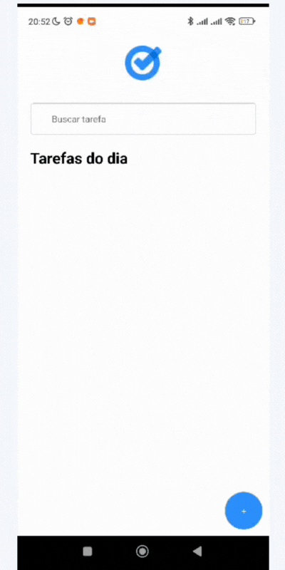

### Teste - React Native com Expo (ToDo List)

<p align="center">
   
</p>

<p align="right">
   
</p>

<h1 align="center"></h1>

<p align="center">
  

  

  

  

</p>

<p align="center">
  <a href="#dart-about">About</a> &#xa0; | &#xa0; 
  <a href="#sparkles-features">Features</a> &#xa0; | &#xa0;
  <a href="#rocket-technologies">Technologies</a> &#xa0; | &#xa0;
  <a href="#white_check_mark-requirements">Requirements</a> &#xa0; | &#xa0;
  <a href="#checkered_flag-starting">Starting</a> &#xa0; | &#xa0;
  <a href="#memo-license">License</a> &#xa0; | &#xa0;
  <a href="https://github.com/agostinhomarcia" target="_blank">Author</a>&#xa0; | &#xa0
  <a href="#" target="_blank" rel="noopener noreferrer">Projeto</a>
</p>

<br>

<hr>

## :dart: About

#### 📚Descrição

<p align="left">

Projeto "Lista de Tarefas" 📋📱

O projeto "Lista de Tarefas" é uma aplicação mobile desenvolvida em React Native, proporcionando aos usuários uma forma eficiente de gerenciar suas tarefas diárias.

Funcionalidades:

Adicionar Tarefa:

Os usuários podem adicionar facilmente novas tarefas à lista utilizando um campo de entrada de texto intuitivo. 📝✨

Buscar Tarefa:

A aplicação apresenta uma barra de pesquisa que possibilita aos usuários filtrar suas tarefas com base em palavras-chave, facilitando a localização de itens específicos. 🔍🚀

Concluir Tarefa:

Cada tarefa exibida na lista pode ser marcada como concluída com um simples toque, proporcionando uma experiência interativa e satisfatória. ✅👏

Excluir Tarefa:

Os usuários têm a flexibilidade de excluir tarefas indesejadas, removendo-as da lista para manter um ambiente organizado. 🗑️🧹

</p>

[Figma do projeto](<https://www.figma.com/file/Sk9LpMq9uTQiUqEaGi16OJ/Clube-todo-(Community)?type=design&node-id=0-1&mode=design&t=gzslxz8n4jIrA5CF-0>)

<h4 align="center"> Todo </h4>

<p align="center">
   
</p>
<hr>

## :sparkles: Features

:heavy_check_mark: Feature 1;\
:heavy_check_mark: Feature 2;\
:heavy_check_mark: Feature 3;

<hr>

## :rocket: Technologies

The following tools were used in this project:

- [React-Native](https://reactnative.dev/docs/getting-started)
- [TypeScript](https://www.w3schools.com/typescript/)
- [Expo](https://docs.expo.dev/)
- [CSS](https://developer.mozilla.org/en-US/docs/Web/CSS)

<hr>

## :white_check_mark: Requirements

Before starting :checkered_flag:, you need to have [Git](https://git-scm.com) and [Node](https://nodejs.org/en/) installed.

## :checkered_flag: Starting

```bash
# Clone this project
$ git clone https://github.com/agostinhomarcia/din-todo.git
# Access
$ cd din-todo
# Install dependencies
$ npm install
# Run the project
$ npx expo start
# The server will initialize in the <exp://192.168.15.5:8081>
```

<hr>

## :memo: License

This project is under the [MIT license](./License).

Made with love by [Márcia Agostinho](https://github.com/agostinhomarcia) 🚀.

<p align="center">
   
</p>

&#xa0;

<a href="#top">Back to top </a>
